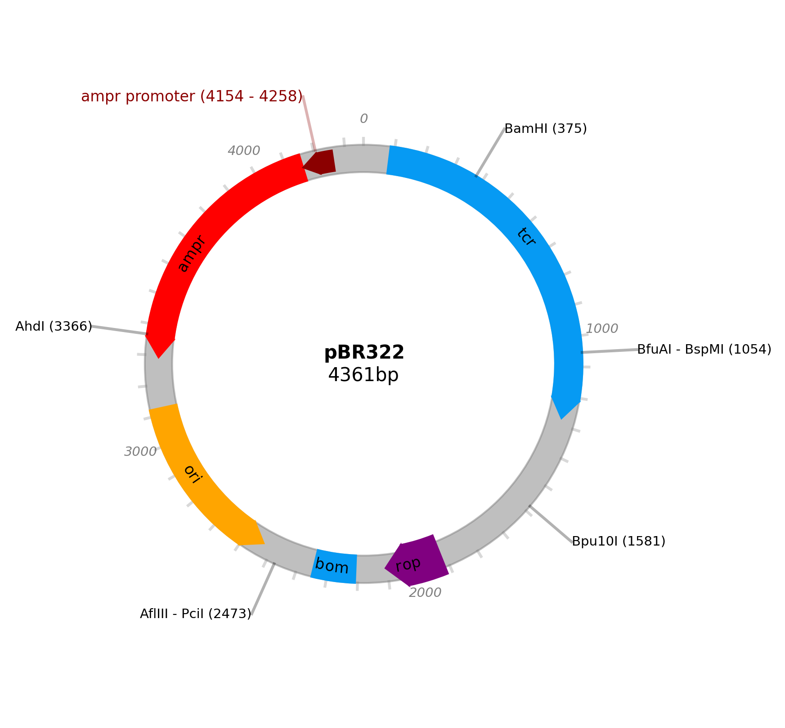

# plasmidcanvas - A simple Python plasmid map creator

Installation, Usage and API referance, hosted on readthedocs **HERE ->** https://plasmidcanvas.readthedocs.io/en/latest/ **<-**

plasmidcanvas is a Python graphics package designed for producing customised plasmid maps. 

**Top level overview of plasmidcanvas' current features as of v1.0.0**

* Directional arrows and rectangles to represent features of a plasmid.
* Support for restriction sites.
* Support for arbitrary labels.
* Support for overlapping features by automatically moving features inwards.
* Support for base pair "ticks".
* Two types of plasmid base pair tick labels:
    * auto - The circle is automatically labelled using the most suitable tick intervals.
    * n_labels - The circle is given n labels, evenly spaced around the plasmid circle.
* Two types of feature labels:
    * off-circle - A label is placed outside the plasmid circle, pointing at the base pair / feature of interest.
    * on-circle (curved text) - A label is placed on a feature and curves around the circle with the feature.
* Plasmids can be saved to a variety of filetypes e.g. png, pdf, ps, eps and svg.

# Examples

